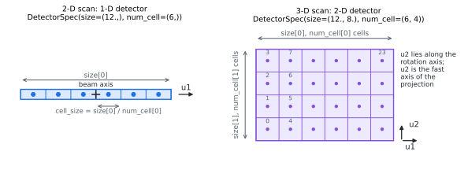

Cheat sheet
===========

Every convention on one page. Each row links to the page that explains it.

.. role:: xtkvol
   :class: xtk-vol
.. role:: xtku1
   :class: xtk-u1
.. role:: xtku2
   :class: xtk-u2
.. role:: xtkax1
   :class: xtk-ax1

The two specs
-------------

   :xtku1:`blue` is ``u1``, :xtku2:`orange` is ``u2``, :xtkax1:`grey` is the
   beam. The lattice figure on :doc:`geometry` shows the same colours on the
   volume.

.. parsed-literal::

   knot = xtk.UniformSpec.centered(step=\ :xtkvol:`1.0`, num=(:xtkax1:`3`, :xtku1:`5`, :xtku2:`4`))
   det = xtk.DetectorSpec(size=(:xtku1:`12.0`, :xtku2:`8.0`), num_cell=(:xtku1:`6`, :xtku2:`4`))

Rules
-----

.. list-table::
   :header-rows: 1
   :widths: 22 46 32

   * - Thing
     - Rule
     - Where it bites
   * - ``start``
     - Centre of the first voxel, not a corner.
     - Half-voxel shifts.
   * - ``step``
     - Pitch between voxel centres, per axis.
     - ---
   * - ``size``
     - Full width of the detector, not the cell pitch. Pitch is
       ``size[k] / num_cell[k]``.
     - A detector too small by ``num_cell``.
   * - Cell centres
     - Cell ``i`` sits at :math:`(i - (N-1)/2) \times` ``cell_size``, so an
       even ``num_cell`` puts the beam axis between two cells.
     - Half-cell offsets.
   * - ``u1``
     - Spans lattice axis 2.
     - Transposed sinograms.
   * - ``u2``
     - Spans lattice axis 3, which is the rotation axis. ``size[1]`` sets the
       axial coverage.
     - Truncated volumes.
   * - Projection layout
     - ``(angles, u1, u2)``, with ``u2`` fastest.
     - Scrambled reconstructions.
   * - ``from_astra``, 3-D
     - ASTRA hands you ``(det_v, angles, det_u)``. Transpose to the layout
       above.
     - Ring artifacts, mirrored volumes.
   * - Angle range
     - :math:`[0, \pi)` for parallel, :math:`[0, 2\pi)` for cone.
     - Wasted work, or a half-scanned cone.
   * - Units
     - Yours, but the volume and the geometry must agree. Voxel units are the
       safer default in single precision.
     - Geometry derivatives orders of magnitude too small.
   * - ``order``
     - 0 voxels, so a matrix entry is a chord length; 1 linear; 2 quadratic.
       In 3-D, ``order > 0`` needs cooperative vectors: Turing or newer, driver
       R570 or newer.
     - A hard failure on older cards.
   * - Iterating
     - Expand once with :py:func:`~xrt_toolkit.struct_rays` and use the
       explicit operators. The structured ones launch a kernel per projection
       per call.
     - Solvers that crawl.
   * - Solver choice
     - CGLS keeps its residual in data space and survives single precision. CG
       on the normal equations can break down on ill-conditioned scans.
     - NaNs a few iterations in.
   * - Stopping
     - Early stopping is the regulariser. More iterations fit the noise.
     - Reconstructions that get worse as you wait.

The whole loop
--------------

.. code-block:: python

   import numpy as np, drjit as dr
   from drjit.cuda.ad import Float
   import xrt_toolkit as xtk

   N = 256
   img = np.zeros((N, N), np.float32)
   img[64:192, 96:160] = 1.0

   knot = xtk.UniformSpec.centered(step=1.0, num=(N, N))
   det = xtk.DetectorSpec(size=(1.5 * N,), num_cell=(384,))
   rays = xtk.parallel_beam(
       dr.linspace(Float, 0, np.pi, 256, endpoint=False), det)

   sino = xtk.xrt_struct_apply(rays, knot, 0, Float(img.ravel()))   # forward
   fbp = np.asarray(xtk.fbp(rays, knot, sino)).reshape(N, N)        # analytic

   re = xtk.struct_rays(rays)                                       # iterative
   cg = np.asarray(xtk.cg(lambda v: xtk.xrt_apply(re, knot, 0, v),
                          lambda v: xtk.xrt_adjoint(re, knot, 0, v),
                          sino, N * N, n_iter=30)).reshape(N, N)

   print(round(float(abs(fbp - img).mean()), 4),
         round(float(abs(cg - img).mean()), 4))

Full discussion in :doc:`geometry` and :doc:`pitfalls`.
