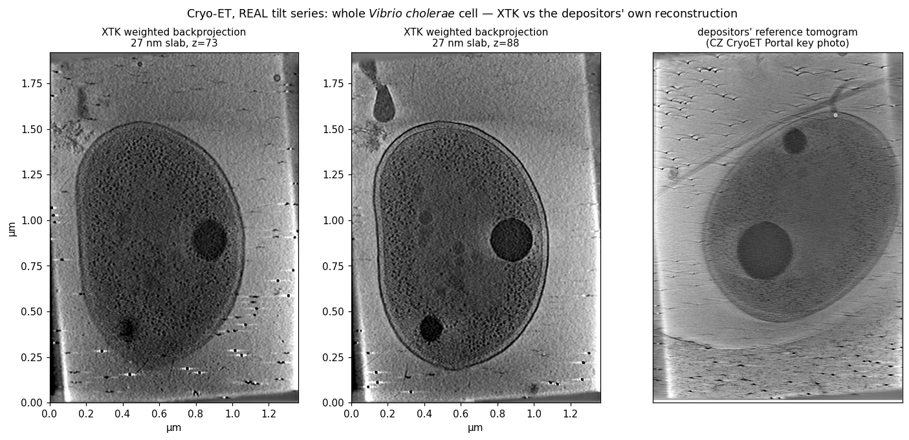
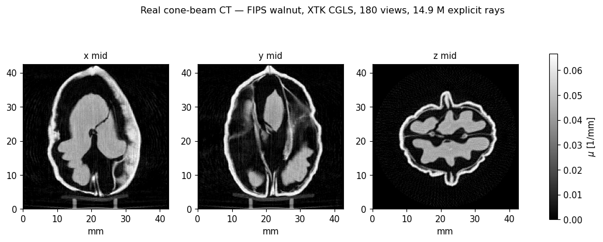
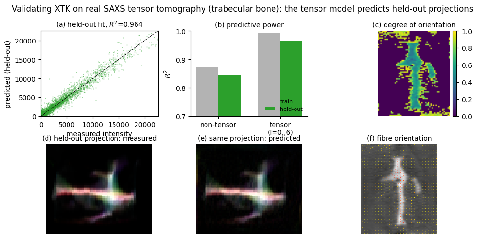
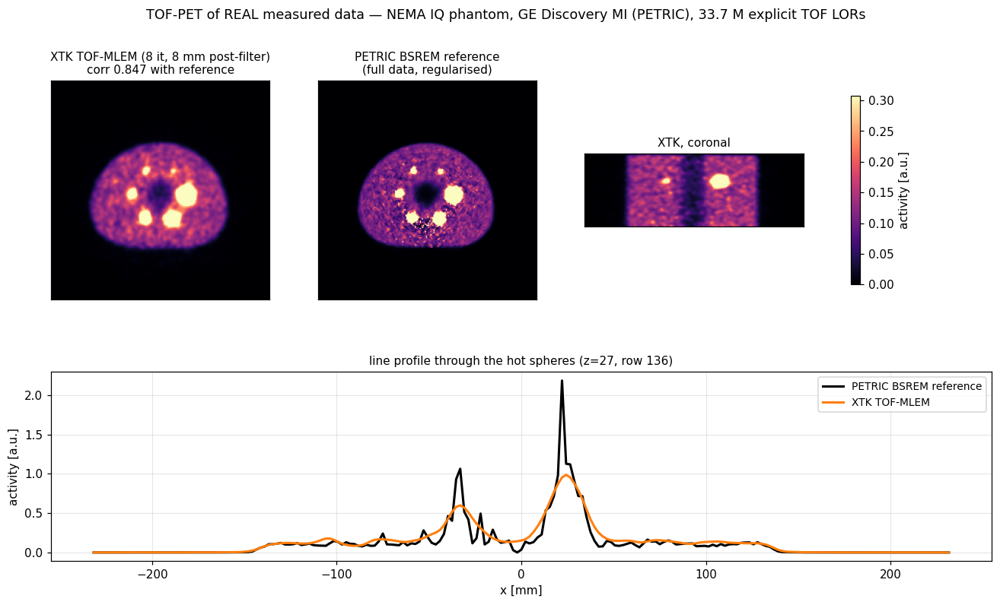
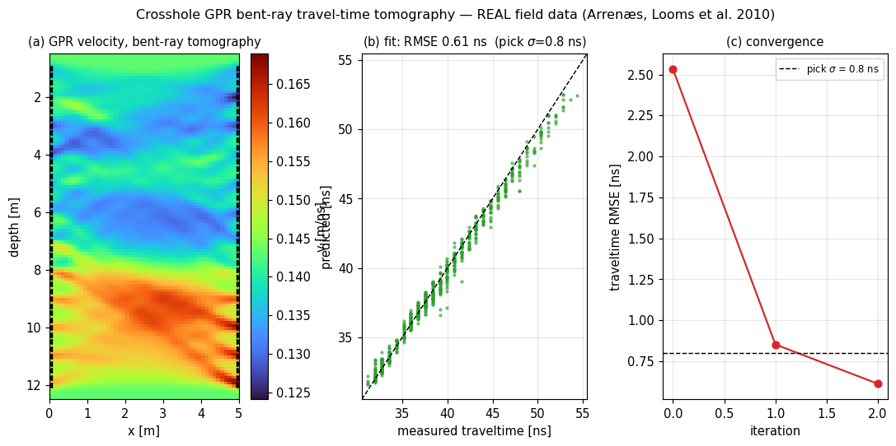
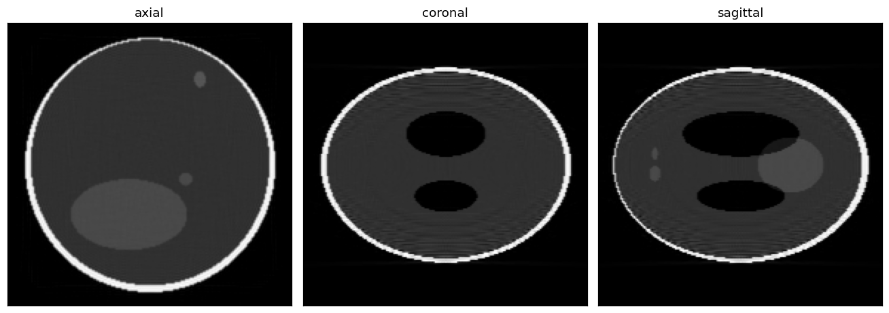
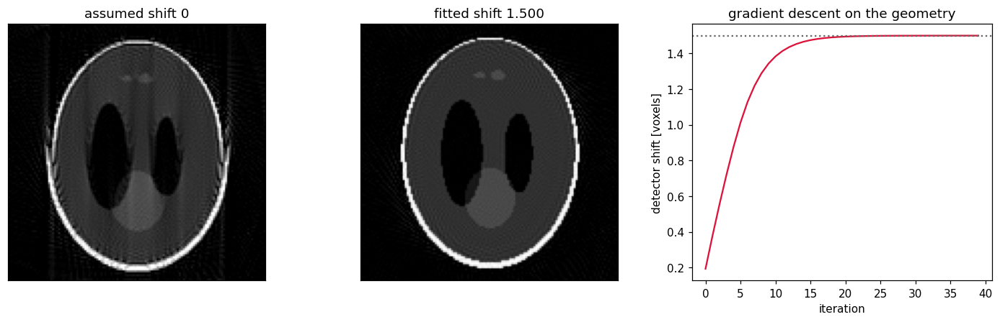
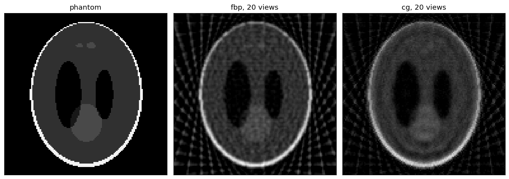

Gallery
=======

Real data
---------

Every reconstruction in this section comes from measured data in a public
archive. The scripts are in ``xtk_experiments/realdata``, and that folder's
README records the download, the preprocessing and the caveats.

Cryo-electron tomography
~~~~~~~~~~~~~~~~~~~~~~~~

A whole *Vibrio cholerae* cell, from CZ CryoET Data Portal dataset 10489
[czi10489]_. A single-axis tilt series: 41 tilts from -53 to +67 degrees,
1023 x 1440, 13.3 A per pixel.

   Two slabs from the XTK reconstruction, beside the depositors' own tomogram.
   The cell envelope, both polyphosphate granules and the appendage all appear
   in the same places.

Use weighted backprojection here, not conjugate gradients. Ramp-filter each
tilt along the direction across the tilt axis, then backproject once. The
problem is heavily underdetermined, and a few CG iterations return a
low-frequency blur in which the granules disappear.

.. code-block:: python

   # single-axis tilt, parallel beam, tilt axis along image y
   t = Array3f(ca[:, None] * u, v, -sa[:, None] * u)
   n = Array3f(sa[:, None] + 0 * u, 0 * u, ca[:, None] + 0 * u)
   rec = xrt_adjoint((t, n), knot, 0, Float(ramp_filtered.ravel()))

Cone-beam CT
~~~~~~~~~~~~

The FIPS walnut scan, Zenodo 6986012 [fips_walnut]_, CC-BY-4.0. Explicit
per-pixel cone-beam rays, 14.9 M of them, solved by CGLS.

   Shell, kernel lobes and septum resolved. Data RMSE 0.0152. The walnut
   measures 33 x 30 x 42 mm.

Tensor tomography
~~~~~~~~~~~~~~~~~

Small-angle scattering tensor tomography of trabecular bone, Zenodo 10074598
[saxstt_bone]_. The fused multi-channel operator carries all spherical-harmonic
channels through one lattice traversal.

   The tensor model predicts held-out projections with R2 = 0.964, against
   0.846 for an isotropic model. Panel (f) shows the fitted fibre orientation.

TOF-PET
~~~~~~~

Real time-of-flight lines of response from the PETRIC ``GE_DMI4_NEMA_IQ``
dataset [petric]_, a GE Discovery MI 4-ring scanner, CC-BY-4.0. 33.7 M LORs,
with TOF weighting through ``tof=TOFSpec(center, sigma)``.

   The NEMA phantom outline, the hot spheres and the cold insert all recover.

This panel is noisier than the PETRIC reference, and the reason is counts, not
the operator. The extracted subset leaves 0.53 prompt counts per support voxel,
so unregularised MLEM is Poisson-dominated. The reference is BSREM on the full
data. Three checks show the model itself is right: forward-projecting the
reference correlates best with the data for the TOF sign as stored, the Poisson
log-likelihood at the reference beats the zero image, and the calibrated
operator scale matches the analytic value to 1.5 per cent.

Bent-ray crosshole GPR
~~~~~~~~~~~~~~~~~~~~~~

Ground-penetrating radar traveltimes from Arrenaes, published by Looms and
co-workers [looms2010]_. Rays bend, so this uses the refractive marcher and its
Fermat-matched adjoint.

   Traveltime RMSE falls from 2.53 to 0.61 ns, against a pick uncertainty of
   0.8 ns. pyGIMLi and the published Bayesian posterior confirm the structure
   independently.

Synthetic examples
------------------

These three come from ``doc/make_figures.py`` and rebuild in one command.

Cone-beam FDK
~~~~~~~~~~~~~

A 192\ :sup:`3` phantom, 720 views, one call.

   Three orthogonal slices.

.. code-block:: python

   sod, sdd = 8.0 * N, 10.0 * N
   rays = xtk.cone_beam(sod=sod, sdd=sdd,
                        angles=dr.linspace(Float, 0, 2*np.pi, 720, endpoint=False),
                        detector_spec=xtk.DetectorSpec(size=(1.6*N, 1.6*N),
                                                       num_cell=(384, 384)))
   y = xtk.xrt_apply(xtk.struct_rays(rays), knot, 0, Float(phantom.reshape(-1)))
   rec = xtk.fbp_cone(rays, knot, y, sod=sod, sdd=sdd, window="shepp-logan")

Fitting the geometry
~~~~~~~~~~~~~~~~~~~~

The scan below has an unknown detector shift. Gradient descent on the ray
positions recovers it to four decimals.

   True shift 1.5 voxels, fitted 1.5000.

.. code-block:: python

   def rays_at(s):                      # slide the detector along its own axis
       return (Array2f(t0[0] + s*ux, t0[1] + s*uy), Array2f(n0))

   s, lr = 0.0, 2e-6
   for _ in range(40):
       rays = rays_at(s)
       resid = xtk.xrt_apply(rays, knot, 1, f) - y_meas
       gx = xtk.xrt_ad_t_x(rays, knot, 1, f)     # d(Af) / d t_x
       gy = xtk.xrt_ad_t_y(rays, knot, 1, f)     # d(Af) / d t_y
       s -= lr * float(dr.sum(resid * (Float(ux)*gx + Float(uy)*gy)).item())

Few views
~~~~~~~~~

Twenty projections. Filtered backprojection streaks. Conjugate gradients on the
same rays does better, because it fits the data instead of inverting an
incomplete integral.

   Phantom, ``fbp`` with a Hann window, and ``cg`` after 40 iterations.

.. code-block:: python

   rays = xtk.parallel_beam(dr.linspace(Float, 0, np.pi, 20, endpoint=False), det)
   re = xtk.struct_rays(rays)
   y = xtk.xrt_apply(re, knot, 0, f)

   a = xtk.fbp(rays, knot, y, window="hann")
   b = xtk.cg(lambda v: xtk.xrt_apply(re, knot, 0, v),
              lambda v: xtk.xrt_adjoint(re, knot, 0, v), y, N*N, n_iter=40)

Basis functions
~~~~~~~~~~~~~~~

The support of the box spline and its projections.

.. list-table::
   :widths: 33 33 33

   * - .. figure:: _static/basis_0.png

          order 0
     - .. figure:: _static/basis_1.png

          order 1
     - .. figure:: _static/basis_2.png

          order 2

.. code-block:: python

   ang = np.linspace(0, np.pi, 5, endpoint=False)
   ray_n = Array2f(np.cos(ang, dtype=np.float32), np.sin(ang, dtype=np.float32))
   fig = xtk.plot_2d_basis(knot, order, ray_n)
