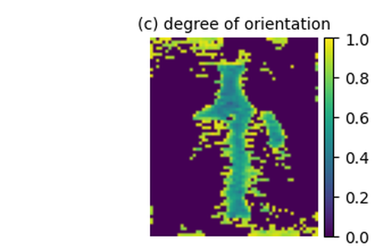

Gallery
=======

Real data
---------

Every reconstruction here comes from measured data in a public archive. The
scripts are in ``xtk_experiments/realdata``.

Cryo-electron tomography
~~~~~~~~~~~~~~~~~~~~~~~~

A whole *Vibrio cholerae* cell, CZ CryoET Data Portal dataset 10489
[czi10489]_. 41 tilts from -53 to +67 degrees, 1023 x 1440, 13.3 A per pixel.

.. figure:: _static/real_cryoet_vibrio.png
   :width: 76%

   The cell envelope, both polyphosphate granules and the appendage, with
   ribosome-scale texture in the cytoplasm. One second.

A single-axis tilt series is a parallel-beam scan, so the whole reconstruction
is two calls: :py:func:`~xrt_toolkit.parallel_beam` for the geometry and
:py:func:`~xrt_toolkit.fbp` to filter and backproject.

.. code-block:: python

   import numpy as np, drjit as dr
   from drjit.cuda.ad import Float
   import xrt_toolkit as xtk

   # g: (n_tilt, NV, NU) tilt images, NV along the tilt axis
   px = 2.666                                   # nm per binned voxel

   # parallel_beam rotates about the third lattice axis, and its first detector
   # axis spans the second. Put the tilt axis on axis 3, and the thin specimen
   # direction on axis 1, where the beam points at zero tilt.
   knot = xtk.UniformSpec.centered(step=px, num=(NZ, NU, NV))
   det = xtk.DetectorSpec(size=(NU * px, NV * px), num_cell=(NU, NV))
   rays = xtk.parallel_beam(Float(np.deg2rad(tilt_angles)), det)

   y = Float(np.transpose(g, (0, 2, 1)).ravel())      # (tilt, u1, u2)
   vol = xtk.fbp(rays, knot, y, window="shepp-logan")

.. note::

   ``fbp`` beats an iterative solve here. Twenty-five CGLS iterations recover
   the same features but leave a low-frequency gradient across the field, and
   they cost five seconds against one. CG on the normal equations does worse
   still: it breaks down in single precision on this problem within a few
   iterations, so use CGLS if you do want to iterate.

Cone-beam CT
~~~~~~~~~~~~

Walnut 1 of the collection of Der Sarkissian and co-workers
[dersarkissian2019]_. The dataset ships an ASTRA ``cone_vec`` geometry file, so
:py:func:`~xrt_toolkit.from_astra` reads it as it stands.

.. figure:: _static/real_ct_walnut_conebeam.png

   603 projections, 113 M rays, a 500\ :sup:`3` reconstruction by 30
   conjugate-gradient iterations. Shell, kernel and septum resolve.

.. code-block:: python

   g = np.loadtxt("scan_geom_corrected.geom")     # ASTRA cone_vec, 12 columns
   g[:, 0:6] /= voxel_mm                          # positions    -> voxel units
   g[:, 6:12] *= bin / voxel_mm                   # detector axes -> voxel units

   rays, knot = xtk.from_astra(
       {"type": "cone_vec", "DetectorRowCount": n_v,
        "DetectorColCount": n_u, "Vectors": g}, vol_geom)

   y = Float(np.transpose(L, (1, 0, 2)).reshape(-1))   # (det_v, angles, det_u)
   rec = xtk.cg(lambda v: xtk.xrt_apply(rays, knot, 0, v),
                lambda v: xtk.xrt_adjoint(rays, knot, 0, v), y, N**3, n_iter=30)

Tensor tomography
~~~~~~~~~~~~~~~~~

Small-angle scattering tensor tomography of trabecular bone, Zenodo 10074598
[saxstt_bone]_. Every voxel carries a full scattering distribution rather than
one number, and the fused operator pushes all its spherical-harmonic channels
through a single lattice traversal.

   How aligned the mineral is, slice by slice. Dark means the scattering is
   the same in every direction; bright means it points one way. The struts run
   bright along their length, which is what bone does.

.. code-block:: python

   w = xtk.lrt_weights(ray_n)                 # (L, C) contraction weights
   y = xtk.xrt_tensor_apply(rays, knot, order, f, w)     # all C channels, one pass
   b = xtk.xrt_tensor_adjoint(rays, knot, order, r, w)

TOF-PET
~~~~~~~

Real time-of-flight lines of response from the PETRIC ``GE_DMI4_NEMA_IQ``
dataset [petric]_, a GE Discovery MI 4-ring scanner. 33.7 M lines of response,
each an explicit ray with its own time-of-flight offset.

.. figure:: _static/real_pet_tof_nema.png

   The NEMA phantom outline, the hot spheres and the cold insert.

This panel is softer than a clinical reconstruction of the same phantom, and
the reason is counts rather than the operator. The extracted subset is one
segment of 205 and every fourth view, which leaves 0.53 prompt counts per
support voxel: fewer counts than unknowns. Unregularised MLEM on that is
Poisson-dominated, so it needs a post-filter, and the post-filter is what costs
the resolution.

.. code-block:: python

   # every LOR is a ray; TOF localises the emission along it
   rays = (Array3f(*end1.T), Array3f(*(end2 - end1).T))
   tof = xtk.TOFSpec(center=offset_mm, sigma=sigma_mm)
   y = xtk.xrt_apply(rays, knot, 0, f, tof=tof)

Synthetic examples
------------------

These come from ``doc/make_figures.py`` and rebuild in one command.

Cone-beam FDK
~~~~~~~~~~~~~

.. figure:: _static/gallery_cone.png

   A 192\ :sup:`3` phantom, 720 views, three orthogonal slices.

.. code-block:: python

   sod, sdd = 8.0 * N, 10.0 * N
   rays = xtk.cone_beam(sod=sod, sdd=sdd,
                        angles=dr.linspace(Float, 0, 2*np.pi, 720, endpoint=False),
                        detector_spec=xtk.DetectorSpec(size=(1.6*N, 1.6*N),
                                                       num_cell=(384, 384)))
   y = xtk.xrt_apply(xtk.struct_rays(rays), knot, 0, Float(phantom.reshape(-1)))
   rec = xtk.fbp_cone(rays, knot, y, sod=sod, sdd=sdd, window="shepp-logan")

Fitting the geometry
~~~~~~~~~~~~~~~~~~~~

.. figure:: _static/gallery_calibration.png

   An unknown detector shift, recovered by gradient descent. True 1.5 voxels,
   fitted 1.5000.

.. code-block:: python

   def rays_at(s):                      # slide the detector along its own axis
       return (Array2f(t0[0] + s*ux, t0[1] + s*uy), Array2f(n0))

   s, lr = 0.0, 2e-6
   for _ in range(40):
       rays = rays_at(s)
       resid = xtk.xrt_apply(rays, knot, 1, f) - y_meas
       gx = xtk.xrt_ad_t_x(rays, knot, 1, f)     # d(Af) / d t_x
       gy = xtk.xrt_ad_t_y(rays, knot, 1, f)     # d(Af) / d t_y
       s -= lr * float(dr.sum(resid * (Float(ux)*gx + Float(uy)*gy)).item())

Few views
~~~~~~~~~

.. figure:: _static/gallery_sparse.png

   Twenty projections. Phantom, ``fbp`` with a Hann window, and ``cg`` after
   40 iterations.

.. code-block:: python

   rays = xtk.parallel_beam(dr.linspace(Float, 0, np.pi, 20, endpoint=False), det)
   re = xtk.struct_rays(rays)
   y = xtk.xrt_apply(re, knot, 0, f)

   a = xtk.fbp(rays, knot, y, window="hann")
   b = xtk.cg(lambda v: xtk.xrt_apply(re, knot, 0, v),
              lambda v: xtk.xrt_adjoint(re, knot, 0, v), y, N*N, n_iter=40)

Basis functions
~~~~~~~~~~~~~~~

.. list-table::
   :widths: 33 33 33

   * - .. figure:: _static/basis_0.png

          order 0
     - .. figure:: _static/basis_1.png

          order 1
     - .. figure:: _static/basis_2.png

          order 2

.. code-block:: python

   ang = np.linspace(0, np.pi, 5, endpoint=False)
   ray_n = Array2f(np.cos(ang, dtype=np.float32), np.sin(ang, dtype=np.float32))
   fig = xtk.plot_2d_basis(knot, order, ray_n)
