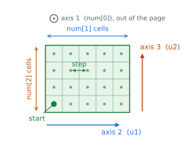

Geometries
==========

A geometry is a set of rays: a point and a direction for each one. You can
build the standard scans with a helper, or pass rays yourself. Both feed the
same kernels.

.. role:: xtkvol
   :class: xtk-vol
.. role:: xtku1
   :class: xtk-u1
.. role:: xtku2
   :class: xtk-u2
.. role:: xtkax1
   :class: xtk-ax1

Conventions
-----------

Two objects fix every convention. :py:class:`~xrt_toolkit.UniformSpec` describes
the voxel lattice, :py:class:`~xrt_toolkit.DetectorSpec` the detector. The
colours carry through to the code: :xtkvol:`green` for the lattice,
:xtku1:`blue` for the ``u1`` detector axis, :xtku2:`orange` for ``u2``, and
:xtkax1:`grey` for the remaining lattice axis and the beam.

The volume
~~~~~~~~~~

   ``start`` is the centre of the first voxel and ``step`` the pitch between
   centres, so the lattice carries no separate origin. In 2-D the beam travels
   along axis 1 at :math:`\theta = 0`. In 3-D that axis points out of the page,
   and the two drawn axes are the ones the detector spans.

.. parsed-literal::

   knot = xtk.UniformSpec(start=\ :xtkvol:`(-1.0, -2.0, -1.5)`, step=\ :xtkvol:`1.0`,
                          num=(:xtkax1:`3`, :xtku1:`5`, :xtku2:`4`))          # 3-D

   knot = xtk.UniformSpec(start=\ :xtkvol:`(-1.0, -2.0)`, step=\ :xtkvol:`1.0`,
                          num=(:xtkax1:`3`, :xtku1:`5`))                # 2-D

:py:meth:`~xrt_toolkit.UniformSpec.centered` gives that same ``start`` from the
step and the counts alone.

The detector
~~~~~~~~~~~~

.. figure:: _static/schem_detector.svg
   :width: 100%

   ``size`` is the full width of the detector, not the pitch. The pitch follows
   as ``size[k] / num_cell[k]``. In 3-D, ``u2`` runs along the rotation axis, so
   ``size[1]`` sets the axial coverage.

.. parsed-literal::

   det = xtk.DetectorSpec(size=(:xtku1:`12.0`, :xtku2:`8.0`),
                          num_cell=(:xtku1:`6`, :xtku2:`4`))             # 3-D

   det = xtk.DetectorSpec(size=(:xtku1:`12.0`,), num_cell=(:xtku1:`6`,))       # 2-D

   rays = xtk.parallel_beam(angles, det)        # sinogram (len(angles), :xtku1:`6`, :xtku2:`4`)

Three rules cover the rest.

* Cells are centred, so cell ``i`` sits at :math:`(i - (N-1)/2) \times`
  ``cell_size``. The beam axis passes through the middle of the detector, which
  falls between two cells when ``num_cell`` is even.
* The projection is laid out ``(angles, u1, u2)``, with ``u2`` fastest. That is
  the numbering in the detector figure. Reshape a sinogram to that order and
  nothing else needs to change.
* Units are yours. Pass millimetres and the volume must be in millimetres too.
  Voxel units are the safer default in single precision; see :doc:`pitfalls`.

Parallel beam
-------------

.. grid:: 1 2 2 2
   :gutter: 3

   .. grid-item::

      .. figure:: _static/schem_parallel.svg

         One angle of a 2-D scan. Every ray shares a direction, and the whole
         assembly rotates about the volume.

   .. grid-item::

      .. figure:: _static/schem_parallel_3d.svg

         The 3-D scan. The detector gains a second axis along the rotation
         axis; the rays stay parallel.

.. code-block:: python

   det = xtk.DetectorSpec(size=(1.5 * N,), num_cell=(192,))
   rays = xtk.parallel_beam(dr.linspace(Float, 0, np.pi, 180, endpoint=False), det)

   y = xtk.xrt_struct_apply(rays, knot, order, f)

Angles cover :math:`[0, \pi)`. A ray at :math:`\theta + \pi` traces the same
line, so a wider sweep only repeats work. Give ``DetectorSpec`` a second axis
and the same call becomes a 3-D scan that rotates about the third lattice axis.

Cone beam
---------

.. grid:: 1 2 2 2
   :gutter: 3

   .. grid-item::

      .. figure:: _static/schem_cone.svg

         A point source, a divergent fan, and a flat detector. ``sod`` is the
         source-to-object distance, ``sdd`` source-to-detector.

   .. grid-item::

      .. figure:: _static/schem_cone_3d.svg

         In 3-D the fan becomes a cone. Magnification is ``sdd / sod``, so the
         detector must be wider than the volume.

.. code-block:: python

   det = xtk.DetectorSpec(size=(2.2 * N, 1.75 * N), num_cell=(216, 168))
   rays = xtk.cone_beam(sod=1.6 * N, sdd=2.8 * N,
                        angles=dr.linspace(Float, 0, 2 * np.pi, 360, endpoint=False),
                        detector_spec=det)

   rec = xtk.fbp_cone(rays, knot, y, sod=sod, sdd=sdd, window="hann")

Angles cover :math:`[0, 2\pi)` here: a divergent beam takes a different path
through the volume at :math:`\theta` and at :math:`\theta + \pi`.

Arbitrary rays
--------------

.. grid:: 1 2 2 2
   :gutter: 3

   .. grid-item::

      .. figure:: _static/schem_explicit.svg

         Nothing has to be regular. Ray :math:`l` carries its own anchor
         :math:`\mathbf{t}^{(l)}` and direction :math:`\mathbf{n}^{(l)}`.

   .. grid-item::

      .. figure:: _static/schem_explicit_3d.svg

         The same in 3-D, where each anchor and direction gains a third
         component. Label colours match the rays they name.

.. code-block:: python

   t = Array2f(t_x, t_y)          # (2, M) anchors, one column per ray
   n = Array2f(n_x, n_y)          # (2, M) directions
   y = xtk.xrt_apply((t, n), knot, order, f)

Rays need share neither an origin, a direction, nor a detector.

This is the path for listmode PET, for a tilt series with gaps, and for a
scanner you are still aligning. In 3-D use ``Array3f``. The directions need not
be normalised.

Structured or explicit
----------------------

The structured operators store one matrix per projection rather than every
ray, so memory stays flat as the scan grows. They loop over projections and
launch one kernel each, which is fine for a single pass and costly inside a
solver.

:py:func:`~xrt_toolkit.struct_rays` expands a structured scan into explicit
rays in the same order, so the fused operators apply. That runs about a hundred
times faster per iteration; the cost is storing every ray, roughly 24 bytes
each.

.. code-block:: python

   rays = xtk.parallel_beam(angles, det)
   re = xtk.struct_rays(rays)              # expand once
   rec = xtk.cg(lambda v: xtk.xrt_apply(re, knot, order, v),
                lambda v: xtk.xrt_adjoint(re, knot, order, v),
                y, n_voxels, n_iter=20)
