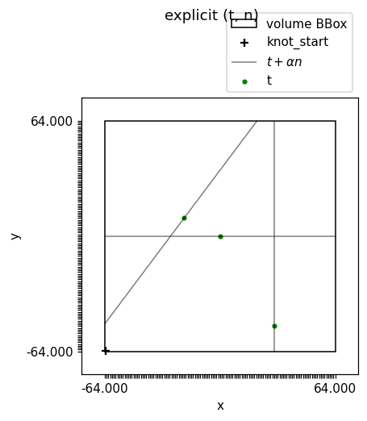

Geometries
==========

A geometry is just a set of rays. The library takes them two ways, and both
feed the same kernels.

Explicit rays
-------------

Any pair of arrays — a point :math:`\mathbf{t}` and a direction
:math:`\mathbf{n}` per ray — is a valid geometry. Nothing has to be regular,
which is what listmode PET, sparse plasma diagnostics or a
calibration-in-progress need.

   Three arbitrary rays, drawn with :py:func:`~xrt_toolkit.plot_rays`.

Structured scans
----------------

:py:func:`~xrt_toolkit.parallel_beam` and :py:func:`~xrt_toolkit.cone_beam`
build standard acquisitions from a list of angles and a
:py:class:`~xrt_toolkit.DetectorSpec`. They store one homogeneous matrix per
projection rather than every ray, so memory stays flat as the scan grows.

.. list-table::
   :widths: 50 50

   * - .. figure:: _static/geom_parallel.png

          ``parallel_beam`` — angles span :math:`[0, \pi)`
     - .. figure:: _static/geom_cone.png

          ``cone_beam`` — a full circle, ``sod`` / ``sdd``

Which interface to use
----------------------

The structured operators (:py:func:`~xrt_toolkit.xrt_struct_apply`) loop over
projections and launch one kernel each: memory-lean for a single pass, but the
launch overhead dominates inside a solver. :py:func:`~xrt_toolkit.struct_rays`
expands a structured scan into explicit rays in the same order, so the fused
single-kernel operators can be used instead — around a hundred times faster per
iteration, at the cost of storing every ray.

.. code-block:: python

   rays = xtk.parallel_beam(angles, det)
   re = xtk.struct_rays(rays)              # expand once
   rec = xtk.cg(lambda v: xtk.xrt_apply(re, knot, order, v),
                lambda v: xtk.xrt_adjoint(re, knot, order, v),
                y, n_voxels, n_iter=20)
