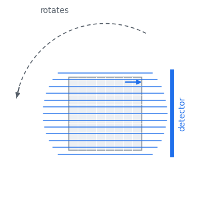
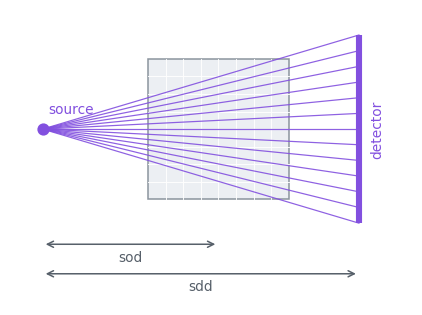
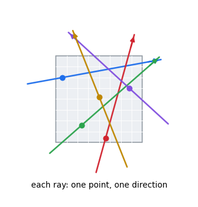

Geometries
==========

A geometry is a set of rays: a point and a direction for each one. You can
build the standard scans with a helper, or pass rays yourself. Both feed the
same kernels.

Parallel beam
-------------

   One angle of a parallel scan. Every ray shares a direction; the whole
   assembly rotates about the volume.

.. code-block:: python

   det = xtk.DetectorSpec(size=(1.5 * N,), num_cell=(192,))
   rays = xtk.parallel_beam(dr.linspace(Float, 0, np.pi, 180, endpoint=False), det)

   y = xtk.xrt_struct_apply(rays, knot, order, f)

Angles cover :math:`[0, \pi)`. A ray at :math:`\theta + \pi` traces the same
line, so a wider sweep only repeats work. Give ``DetectorSpec`` a second axis
and the same call becomes a 3-D scan that rotates about the third lattice axis.

Cone beam
---------

   A point source, a divergent fan, and a flat detector. ``sod`` is the
   source-to-object distance, ``sdd`` source-to-detector.

.. code-block:: python

   det = xtk.DetectorSpec(size=(2.2 * N, 1.75 * N), num_cell=(216, 168))
   rays = xtk.cone_beam(sod=1.6 * N, sdd=2.8 * N,
                        angles=dr.linspace(Float, 0, 2 * np.pi, 360, endpoint=False),
                        detector_spec=det)

   rec = xtk.fbp_cone(rays, knot, y, sod=sod, sdd=sdd, window="hann")

Angles cover :math:`[0, 2\pi)` here: a divergent beam takes a different path
through the volume at :math:`\theta` and at :math:`\theta + \pi`.

Arbitrary rays
--------------

   Nothing has to be regular. Each ray carries its own point and direction.

.. code-block:: python

   t = Array2f(t_x, t_y)          # (2, M) anchors, one column per ray
   n = Array2f(n_x, n_y)          # (2, M) directions
   y = xtk.xrt_apply((t, n), knot, order, f)

This is the path for listmode PET, for a tilt series with gaps, and for a
scanner you are still aligning. In 3-D use ``Array3f``. The directions need not
be normalised.

Structured or explicit
----------------------

The structured operators store one matrix per projection rather than every
ray, so memory stays flat as the scan grows. They loop over projections and
launch one kernel each, which is fine for a single pass and costly inside a
solver.

:py:func:`~xrt_toolkit.struct_rays` expands a structured scan into explicit
rays in the same order, so the fused operators apply. That runs about a hundred
times faster per iteration; the cost is storing every ray, roughly 24 bytes
each.

.. code-block:: python

   rays = xtk.parallel_beam(angles, det)
   re = xtk.struct_rays(rays)              # expand once
   rec = xtk.cg(lambda v: xtk.xrt_apply(re, knot, order, v),
                lambda v: xtk.xrt_adjoint(re, knot, order, v),
                y, n_voxels, n_iter=20)
