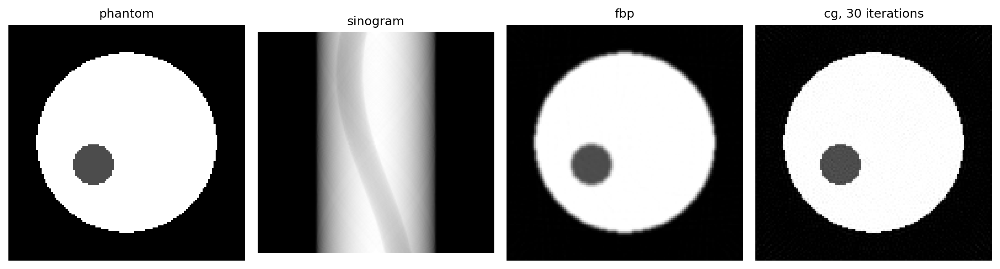

XRT Toolkit
===========

.. rst-class:: xtk-lead

   GPU X-ray transforms and reconstruction, built on `Dr.Jit
   <https://drjit.readthedocs.io>`_. Project a volume along any set of rays,
   apply the exact transpose, and differentiate with respect to the rays
   themselves.

.. code-block:: python

   import numpy as np, drjit as dr
   from drjit.cuda.ad import Float
   import xrt_toolkit as xtk

   N = 512
   img = np.zeros((N, N), np.float32)
   img[128:384, 192:320] = 1.0                  # something to project

   knot = xtk.UniformSpec.centered(step=1.0, num=(N, N))
   det = xtk.DetectorSpec(size=(1.5 * N,), num_cell=(768,))
   rays = xtk.parallel_beam(
       dr.linspace(Float, 0, np.pi, 512, endpoint=False), det)

   sino = xtk.xrt_struct_apply(rays, knot, 0, Float(img.ravel()))
   fbp = np.asarray(xtk.fbp(rays, knot, sino)).reshape(N, N)

   re = xtk.struct_rays(rays)               # expand once, then iterate
   cg = np.asarray(xtk.cg(lambda v: xtk.xrt_apply(re, knot, 0, v),
                          lambda v: xtk.xrt_adjoint(re, knot, 0, v),
                          sino, N * N, n_iter=30)).reshape(N, N)

   print(round(float(abs(fbp - img).mean()), 4),
         round(float(abs(cg - img).mean()), 4))
   # 0.0022 0.0036

.. grid:: 1 3 3 3
   :gutter: 2
   :class-container: xtk-hero

   .. grid-item::

      .. button-ref:: gallery
         :ref-type: doc
         :color: primary
         :expand:

         Real-data gallery

   .. grid-item::

      .. button-ref:: geometry
         :ref-type: doc
         :color: primary
         :outline:
         :expand:

         Conventions

   .. grid-item::

      .. button-link:: https://github.com/SepandKashani/xrt_toolkit
         :color: primary
         :outline:
         :expand:

         Source

Both directions work in 2-D and 3-D, on box-spline bases, so you can fit the
scan geometry as well as the image.

.. figure:: _static/forward_adjoint.png

   An image, its sinogram, and the backprojection of that sinogram.

.. grid:: 2
   :gutter: 3

   .. grid-item-card:: Any geometry
      :link: geometry
      :link-type: doc

      Parallel, fan and cone scans come from one call. You can also pass a
      plain list of rays. Listmode PET and an uncalibrated benchtop scanner
      need no special case.

   .. grid-item-card:: Differentiable acquisition
      :link: transform
      :link-type: doc

      Derivatives with respect to ray positions and directions. A detector
      offset or a centre of rotation can be a learnable parameter.

   .. grid-item-card:: Reconstruction included
      :link: api
      :link-type: doc

      ``fbp``, ``fbp_cone``, ``bpf``, ``cg`` and ``gd``. Filtering runs on the
      GPU. A 640\ :sup:`3` cone-beam volume takes 3.4 s.

   .. grid-item-card:: Beyond attenuation
      :link: api
      :link-type: doc

      Fused multi-channel operators for tensor tomography, curved-ray
      travel-time tomography, and time-of-flight weighting for PET.

.. toctree::
   :maxdepth: 2
   :hidden:

   gallery
   cheatsheet
   transform
   geometry
   interop
   performance
   tutorials
   api
   pitfalls
   citing
   bibliography

Installation
------------

.. code-block:: bash

   pip install "xrt_toolkit@git+https://github.com/SepandKashani/xrt_toolkit.git@v2"

You need a CUDA GPU. Dr.Jit 1.4 requires compute capability 7.5 or newer. On
older cards such as the V100, install ``drjit<1.4``.

First steps
-----------

Copy this whole block and run it. It needs nothing but the library, NumPy and
Matplotlib.

.. code-block:: python

   import numpy as np, drjit as dr
   from drjit.cuda.ad import Float
   import xrt_toolkit as xtk

   # A phantom: a disc with a hole, so there is some detail to lose.
   N = 128
   yy, xx = np.mgrid[:N, :N] - (N - 1) / 2
   image = ((xx**2 + yy**2) < (0.38 * N) ** 2).astype(np.float32)
   image[(xx + 18) ** 2 + (yy - 12) ** 2 < 11**2] = 0.3

   # Geometry: 180 parallel projections onto a 192-cell detector.
   knot = xtk.UniformSpec.centered(step=1.0, num=(N, N))
   det = xtk.DetectorSpec(size=(1.5 * N,), num_cell=(192,))
   angles = dr.linspace(Float, 0, np.pi, 180, endpoint=False)
   rays = xtk.parallel_beam(angles, det)

   # Forward projection. Order 0 means voxels, so a matrix entry is a chord length.
   sino = xtk.xrt_struct_apply(rays, knot, 0, Float(image.ravel()))

   # Two ways back: filtered backprojection, and 30 iterations of CG.
   fbp = np.asarray(xtk.fbp(rays, knot, sino)).reshape(N, N)

   re = xtk.struct_rays(rays)          # expand once; the solver calls A many times
   cg = np.asarray(xtk.cg(lambda v: xtk.xrt_apply(re, knot, 0, v),
                          lambda v: xtk.xrt_adjoint(re, knot, 0, v),
                          sino, N * N, n_iter=30)).reshape(N, N)

   print(f"sinogram {len(sino)} samples, reconstruction {fbp.shape}")
   print(f"mean absolute error   fbp {np.abs(fbp - image).mean():.4f}"
         f"   cg {np.abs(cg - image).mean():.4f}")

   import matplotlib.pyplot as plt
   fig, ax = plt.subplots(1, 4, figsize=(12, 3.2))
   ax[0].imshow(image, cmap="gray", vmin=0, vmax=1)
   ax[1].imshow(np.asarray(sino).reshape(180, 192), cmap="gray")
   ax[2].imshow(fbp, cmap="gray", vmin=0, vmax=1)
   ax[3].imshow(cg, cmap="gray", vmin=0, vmax=1)
   for a, title in zip(ax, ("phantom", "sinogram", "fbp", "cg, 30 iterations")):
       a.set_title(title); a.set_axis_off()
   plt.show()

It prints ``sinogram 34560 samples, reconstruction (128, 128)`` and draws this.

   The phantom, its sinogram, and the same data back through both routes. On a
   shared grey scale, ``fbp`` softens the edges while CG holds them.

Thirty iterations is where CG passes ``fbp`` on data this clean: ``0.0160``
against ``0.0176``. It keeps improving from there, reaching ``0.0101`` at 60 and
``0.0047`` at 120. Add noise and the ordering flips, because the normal
equations amplify it; stopping early, not iterating longer, is what keeps CG
usable then. :doc:`pitfalls` covers when to reach for which.

Every convention on one page is in the :doc:`cheatsheet`. Read
:doc:`transform` for what the operators compute, or open the
:doc:`tutorials`.
