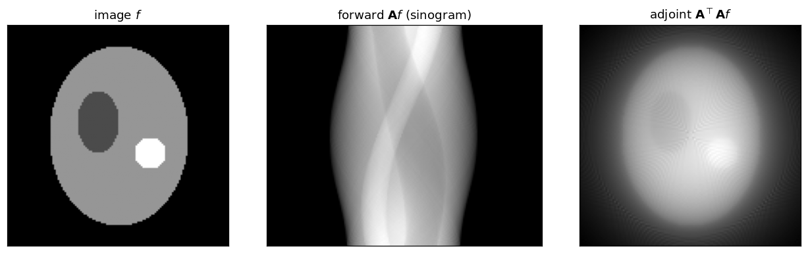
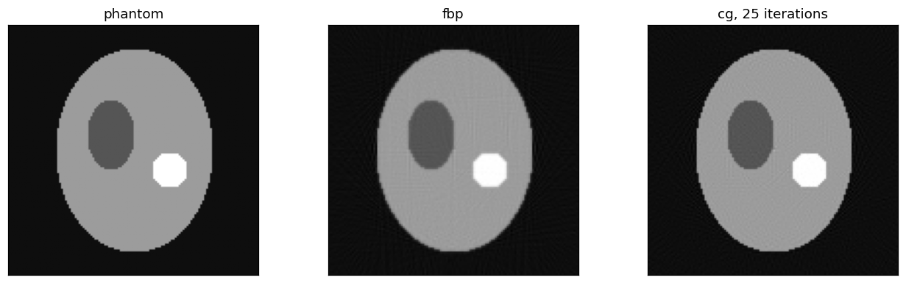

The X-ray transform
===================

Definition
----------

The library discretises the X-ray transform of a function
:math:`f: \mathbb{R}^{D} \to \mathbb{R}`, with :math:`D` equal to 2 or 3. A ray
is a point :math:`\mathbf{t}` and a direction :math:`\mathbf{n}`:

.. math::

   (\mathbf{A} f)(\mathbf{t}, \mathbf{n})
   = \int_{\mathbb{R}} f(\mathbf{t} + \alpha \mathbf{n}) \, \mathrm{d}\alpha .

The volume is not a black box. Expand :math:`f` on a shifted basis over a
uniform lattice :math:`\mathbf{x}_{\mathbf{q}} = \mathbf{x}_{0} +
\mathbf{q} \odot \boldsymbol{\Delta}`:

.. math::

   f(\mathbf{x}) = \sum_{\mathbf{q}} f_{\mathbf{q}} \,
                   \psi(\mathbf{x} - \mathbf{x}_{\mathbf{q}}).

The transform then becomes a sparse matrix on the coefficients
:math:`f_{\mathbf{q}}`. Each entry is the projected basis,
:math:`\int \psi(\mathbf{t} + \alpha \mathbf{n}) \mathrm{d}\alpha`. The
traversal kernel evaluates that integral cell by cell.

Basis functions
---------------

:math:`\psi` is a box spline of order 0, 1 or 2. You choose it with the
``order`` argument.

Order 0 is the voxel indicator. Its matrix entries are the chord lengths of
the ray inside each cell, as in Siddon [siddon1985]_. Higher orders are
smoother and their projections are wider.

Each figure shows the support of :math:`\psi` on the lattice and its 1-D
projections. :py:func:`~xrt_toolkit.plot_2d_basis` draws them.

.. list-table::
   :widths: 33 33 33

   * - .. figure:: _static/basis_0.png

          order 0, voxels
     - .. figure:: _static/basis_1.png

          order 1, linear
     - .. figure:: _static/basis_2.png

          order 2, quadratic

The adjoint
-----------

:py:func:`~xrt_toolkit.xrt_adjoint` is the transpose of
:py:func:`~xrt_toolkit.xrt_apply`. It is not an approximation of the
backprojection integral. The same traversal visits the same cells with the
same weights, and scatters instead of gathering.

Iterative solvers need that. The identity
:math:`\langle \mathbf{A} f, y \rangle = \langle f, \mathbf{A}^{\top} y
\rangle` must hold to machine precision, and the test suite checks it.

   An image, its sinogram, and the unfiltered backprojection of that sinogram.
   The backprojection is blurred by :math:`1/r`. Filtering undoes that blur.

Filtered backprojection
-----------------------

For a parallel scan, the inversion formula filters each projection with the
ramp :math:`|\sigma|` before backprojecting:

.. math::

   f = \frac{\pi}{N_{\text{proj}}} \sum_{\theta}
       \mathbf{A}_{\theta}^{\top} \left( h * p_{\theta} \right),
   \qquad \hat{h}(\sigma) = |\sigma| \, w(\sigma).

Here :math:`w` is a smoothing window. The choices are ``"ramp"``,
``"shepp-logan"``, ``"cosine"``, ``"hamming"`` and ``"hann"``.

The library builds :math:`h` as the discrete kernel of Kak and Slaney
[kak1988]_ on a padded grid. That keeps its DC component at zero. The ramp
stops at the frequency the reconstruction lattice can represent. A detector
finer than the lattice carries frequencies the volume cannot hold, and those
only alias.

For divergent scans, :py:func:`~xrt_toolkit.fbp_cone` follows Feldkamp, Davis
and Kress [feldkamp1984]_. It pre-weights by
:math:`\mathrm{sdd}/\sqrt{\mathrm{sdd}^2 + u^2 + v^2}`, applies the same ramp
along the in-plane axis, then backprojects with a distance weight.

FDK is exact in the mid-plane only. A circular source orbit violates Tuy's
condition away from it [tuy1983]_, and the resulting artifacts grow with the
cone angle.

   The same data, reconstructed analytically and iteratively. On noiseless
   data the iterative solution wins. Add noise and the ranking flips, so stop
   it early.

Geometry derivatives
--------------------

The projected basis is differentiable in the ray parameters, so the whole
transform is too. :py:func:`~xrt_toolkit.xrt_ad_t_x` and its siblings return

.. math::

   \frac{\partial}{\partial t_{i}} (\mathbf{A} f), \qquad
   \frac{\partial}{\partial n_{i}} (\mathbf{A} f).

You can therefore fit the acquisition geometry by gradient descent. The
:doc:`gallery` recovers a detector shift this way, and the 2-D tutorial walks
through the code.
